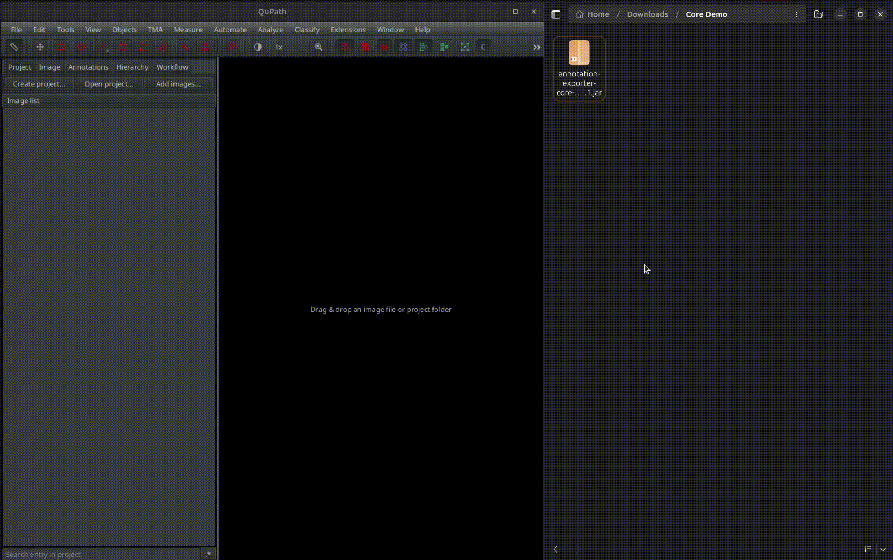

# Scripting with annotation-exporter-core

Groovy scripts created with annotation-exporter-core can be run
directly through the QuPath GUI or via the command line using 
the QuPath executable, after *importing the library*.
More information on the matter can be found in the QuPath Documentation:  
- [QuPath CLI](https://qupath.readthedocs.io/en/stable/docs/advanced/command_line.html)
- [QuPath Scripting](https://qupath.readthedocs.io/en/stable/docs/scripting/overview.html)

## Importing  the library
Download and drag the `.jar` file found in the *Releases* section
of this repo on the QuPath GUI (as shown in **Figure 1**,
in the example I've already imported the library so the pop-up is
asking me if I want to proceed, in a fresh installation, you shouldn't
get that). Alternatively, you can paste the `.jar` file in QuPath's **extensions** folder as
documented [here](https://qupath.readthedocs.io/en/stable/docs/intro/extensions.html)
(you can find out where that folder is by clicking
`Edit` > `Preferences` > `Extensions` in the QuPath GUI).  

<p align="center">
  
</p>

<p align="center">
  <strong>Figure 1.</strong> <em>annotation-exporter-core installation via GUI.</em>
</p>

Then, when you want to use the library
in a Groovy script, add the following lines to your script:

```groovy
import annotationexporter.core.AnnotationExporter
import annotationexporter.core.FilterMode
import annotationexporter.core.AnnotationExporter.LabelResult
```

## *export_annotations.groovy*

This script exports all annotations in the current image in a similar manner
as the [QuPath Annotation Exporter Extension](https://github.com/Luxi99/qupath-extension-annotation-exporter).
It can be run directly from the QuPath GUI using `Automate` > `Scripts` > `Run for project`,
via the command line or via the special *Python* [script](run_export.py) in this folder
(suggested method). This is done by using the following command:

```shell
python run_export.py
```

For documentation or usage examples, run:

```shell
python run_export.py --help
```

> **Note:** the exported masks and TSVs are saved in a folder named 'exports'
> in the same directory as the QuPath project file (`.qpproj`).

